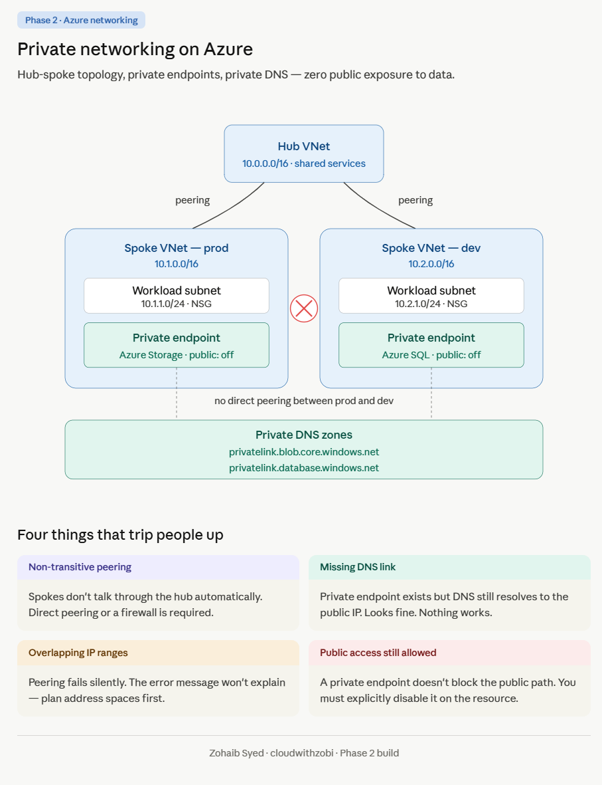
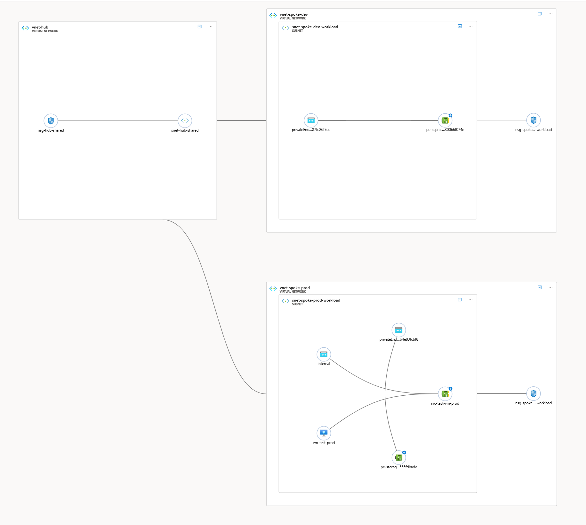

# Azure Private Network Blueprint

A production-pattern private networking design on Azure, built with Terraform. Hub-spoke topology, Private Endpoints for data services, Private DNS zone integration, and zero public exposure to storage and database traffic.

This is Phase 2 of a cloud engineering portfolio series documenting real builds, real security decisions, and real incidents encountered along the way.

---

## 🔹 Quick Summary

* **Zero public exposure** for Storage and SQL enforced through layered security controls
* Built a hub-spoke Azure network using Terraform (30 resources)
* Implemented Private Endpoints + Private DNS for internal-only access
* Validated connectivity using DNS resolution and network testing (`nslookup`, `curl`)
* Diagnosed and fixed real-world misconfigurations (documented in runbook)

---

## 🎯 Why This Matters

This design reflects real-world enterprise patterns for protecting sensitive workloads, where data must remain on private networks and never traverse the public internet.

It demonstrates:

* Environment isolation (no dev ↔ prod lateral movement)
* Defense-in-depth security at the resource level
* Private connectivity using Azure-native services
* Practical troubleshooting of cloud networking and DNS issues

---

## Architecture

Three VNets with non-overlapping address spaces form a hub-spoke topology. Each spoke is peered bidirectionally to the hub but not to each other, enforcing isolation between environments. Azure Storage and Azure SQL Database are deployed with Private Endpoints in their respective spokes, with public network access explicitly disabled. Private DNS zones are linked to the VNets that need private resolution.

👉 No direct peering between prod and dev prevents lateral movement and enforces strict environment separation.

### Live deployed topology (Azure Network Watcher)

---

## What's built

| Category             | Resources                                                       |
| -------------------- | --------------------------------------------------------------- |
| Network backbone     | 3 VNets, 3 subnets, 3 NSGs, 4 VNet peerings                     |
| Data services        | 1 Storage Account, 1 SQL Server, 1 SQL Database                 |
| Private connectivity | 2 Private Endpoints, 2 Private DNS Zones, 2 DNS zone VNet links |
| Validation           | 1 Ubuntu VM in the prod spoke for end-to-end testing            |

Total: 30 Azure resources, fully defined in Terraform and deployed in ~5–7 minutes.

---

## Address design

| VNet            | Address space | Subnet                   | Subnet CIDR |
| --------------- | ------------- | ------------------------ | ----------- |
| vnet-hub        | 10.0.0.0/16   | snet-hub-shared          | 10.0.1.0/24 |
| vnet-spoke-prod | 10.1.0.0/16   | snet-spoke-prod-workload | 10.1.1.0/24 |
| vnet-spoke-dev  | 10.2.0.0/16   | snet-spoke-dev-workload  | 10.2.1.0/24 |

No overlaps. No spoke-to-spoke peering. Any cross-spoke traffic would require routing through a hub-based network virtual appliance, which is not in scope for this phase.

---

## Repository layout
    .
    ├── main.tf              # All Azure resources
    ├── variables.tf         # Input variable definitions
    ├── outputs.tf           # Output values after apply
    ├── terraform.tfvars     # Variable values (gitignored)
    ├── .gitignore           # Excludes state, tfvars, SSH keys
    ├── README.md            # This file
    ├── RUNBOOK.md           # Documented incidents and resolutions
    └── images/              # Architecture diagrams and topology screenshots
---

## Security posture

The goal was zero public exposure to data services. Private Endpoints add a private network path but do not close the public path by themselves. Each data service was hardened explicitly.

### Storage Account settings required:

* `public_network_access_enabled = false`
* `allow_nested_items_to_be_public = false`
* `network_rules { default_action = "Deny", bypass = ["AzureServices"] }`

All three are required. Setting only one leaves gaps at other layers. This was discovered during validation and documented in Incident 1 of the runbook.

👉 Key takeaway: Azure Storage security is layered — partial configuration still leaves exposure.

### SQL Server settings required:

* `public_network_access_enabled = false`

SQL's security model is simpler than Storage's because SQL was designed enterprise-first with a deny-by-default firewall. Storage evolved over 15 years across use cases like static website hosting, so it has layered permissive defaults that must all be explicitly overridden.

---

### Network boundaries:

* NSGs on every subnet
* Bidirectional VNet peering between hub and each spoke
* No direct peering between prod and dev (isolation enforced)
* Public access to both data services explicitly disabled at the resource level

---

## How to deploy

Prerequisites:

* Azure subscription with permission to create networking and data resources
* Terraform 1.5 or later installed
* Azure CLI installed and authenticated with `az login`
* An SSH public key for the test VM (path in main.tf is `~/.ssh/azure_phase1.pub`)

Clone and configure:
    git clone https://github.com/cloudwithzobi/azure-private-network-blueprint.git
    cd azure-private-network-blueprint
Create your own terraform.tfvars with the five required values (this file is gitignored):
    location             = "Canada Central"
    resource_group_name  = "rg-phase2-network"
    storage_account_name = "stexampleXXXX"
    sql_server_name      = "sqlexample-XXXX"
    sql_admin_password   = "YourSecurePassword16+Chars!"
Storage account names must be globally unique across Azure, 3 to 24 characters, lowercase alphanumeric only. SQL server names must also be globally unique, lowercase, hyphens allowed.

Deploy:
    terraform init
    terraform plan -out=tfplan
    terraform apply "tfplan"
Apply takes about 5 to 7 minutes total. VNets are fast. Private Endpoints and SQL Server are the slowest resources.

---

## How to verify

After apply succeeds, SSH into the test VM (output shows the public IP) and run:

Check DNS resolves storage to a private IP:
    nslookup stexampleXXXX.blob.core.windows.net
Expected: response returns 10.1.1.x, the private IP of the Private Endpoint NIC in the prod spoke subnet.

Check private path to storage works:
    curl -v https://stexampleXXXX.blob.core.windows.net
Expected: connection established to private IP, TLS handshake completes.

Check public path is blocked from outside the VNet:
    curl https://stexampleXXXX.blob.core.windows.net/?comp=list
Expected: HTTP 403, this request is not authorized to perform this operation.

Check Private Endpoint health:
    az network private-endpoint list \
      --resource-group rg-phase2-network \
      --query "[].{Name:name, State:privateLinkServiceConnections[0].privateLinkServiceConnectionState.status}" \
      --output table
Expected: two endpoints, both Approved.

---

## How to destroy

When done, always tear down to avoid ongoing Storage and SQL costs:
    terraform destroy
Takes about 5 minutes. Confirms removal of all 30 resources. Responsible cost discipline is part of responsible engineering — always destroy non-production environments when they're not needed.

---

## Incidents documented

The full runbook is in RUNBOOK.md. Two incidents are captured in detail.

### Incident 1

Storage account returned HTTP 400 from public internet despite publicNetworkAccess being set to Disabled. During post-deployment validation, the storage account's public endpoint was still processing HTTP requests. Investigation revealed that publicNetworkAccess is one of three independent security settings on Azure Storage, and the other two (allowBlobPublicAccess and networkRuleSet.defaultAction) were at their permissive defaults. The three settings were added to the service at different times over 15 years, and Microsoft kept their defaults permissive to avoid breaking existing customers.

Fix: explicitly set all three in Terraform. Verified live with Azure CLI before and after.

---

### Incident 2

Storage hostname resolving to public IP from prod VNet despite Private Endpoint being Approved. Simulated a configuration drift scenario where a Private DNS Zone VNet link was deleted outside of Terraform. Investigation used `nslookup`, `az network private-endpoint show`, and `az network private-dns link vnet list` to isolate the failure across three separate resources — the Private Endpoint, the DNS record, and the VNet link — confirming that the PE and record were intact and only the zone-to-VNet link was missing.

Fix: reconciled via `terraform apply` rather than a direct CLI fix, treating Terraform as the source of truth.

👉 Key takeaway: Private Endpoint, DNS, and VNet links are separate components that can fail independently. Investigation methodology matters more than knowing specific commands.

---

## What I would change in production

This build is a portfolio-scale demonstration. In a real production deployment:

* Azure Firewall in the hub with route tables for inspected traffic
* Restrict SSH access to known IP ranges
* Add SQL Private Endpoints to all environments
* Store secrets in Azure Key Vault
* Use remote Terraform state (Azure Storage backend)
* Enable diagnostic logging and monitoring (Log Analytics)

---

## Phase context

This repository is Phase 2 of a multi-phase cloud engineering portfolio.

* Phase 1: Linux infrastructure and CI/CD — [azure-hardened-linux-server](https://github.com/cloudwithzobi/azure-hardened-linux-server)
* Phase 2: Private networking (this repo)
* Phase 3: Kubernetes and observability
* Phase 4: GitOps (ArgoCD)
* Phase 5: Enterprise-scale architecture rebuild

---

## Author

Built by Zohaib Syed (Zobi), transitioning into cloud engineering from 15+ years in banking and finance. Calgary, Alberta, Canada.

* LinkedIn: [linkedin.com/in/zohaibsyed365](https://linkedin.com/in/zohaibsyed365)
* GitHub: [github.com/cloudwithzobi](https://github.com/cloudwithzobi)
